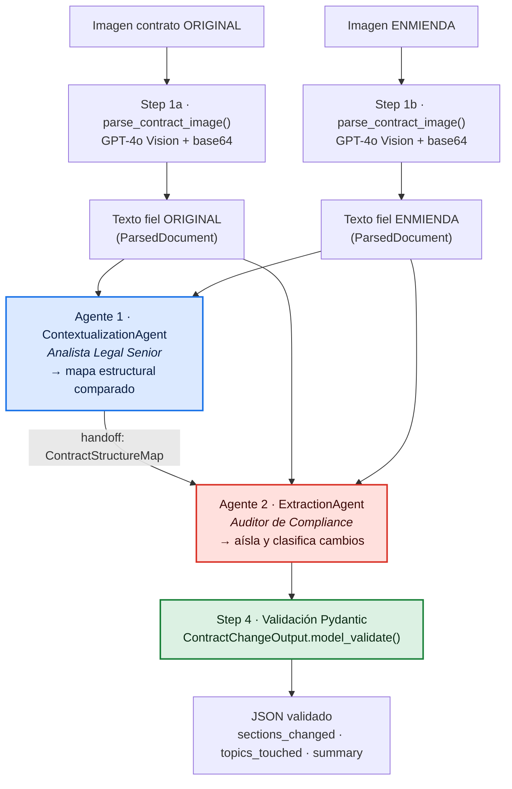

# LegalMove · Agente Autónomo de Comparación de Contratos

Sistema **multi-agente** que recibe las imágenes escaneadas de un **contrato
original** y su **enmienda (adenda)**, las lee con **GPT-4o (Visión)** y, mediante
dos agentes especializados que colaboran, identifica y resume los cambios
legales, devolviendo un **JSON estrictamente validado con Pydantic** y una
**traza jerárquica completa en Langfuse**.

---

## 1. Problema de negocio

En **LegalMove** el equipo de Compliance dedica **+40 h/semana** a comparar
manualmente contratos contra sus adendas para detectar qué cambió y evaluar el
impacto legal. Es lento, propenso a error humano y un cuello de botella para
escalar.

Este sistema automatiza ese trabajo: de dos imágenes a un **reporte estructurado
y auditable** que los sistemas de la empresa pueden procesar sin intervención
humana.

---

## 2. Arquitectura



**Flujo de datos (handoff explícito):**

1. **Visión** → cada imagen se valida, se codifica en base64 y se envía a GPT-4o
   con un prompt de transcripción fiel. Salida: `ParsedDocument` (texto +
   tokens + latencia).
2. **Agente 1 (Contextualización)** → recibe ambos textos y produce un
   `ContractStructureMap`: qué secciones existen en cada documento, cómo se
   corresponden y qué gobierna cada bloque. **No** extrae cambios.
3. **Agente 2 (Extracción)** → recibe **el mapa del Agente 1** + ambos textos y
   aísla cada cambio, clasificándolo en ADICIÓN / ELIMINACIÓN / MODIFICACIÓN.
   Salida: `ContractChangeOutput`.
4. **Validación Pydantic** → `model_validate()` explícito sobre la salida, además
   de los *structured outputs* que ya restringen al modelo en origen.

### Jerarquía de la traza en Langfuse

```
contract-analysis                    ← span raíz (= trace)
├── parse_original_contract          ← span  ─┐ generación GPT-4o Vision
│   └── (generation: gpt-4o)                  │ tokens + latencia (auto)
├── parse_amendment_contract         ← span  ─┘
├── contextualization_agent          ← span  ─┐ generación ChatOpenAI
│   └── (generation: gpt-4o)                  │ vía CallbackHandler (auto)
├── extraction_agent                 ← span  ─┘
│   └── (generation: gpt-4o)
└── pydantic_validation              ← span  (input/output/schema)
```

Cada `span` registra `input`, `output` y `metadata` (caracteres, tokens,
latencia, modelo, nº de secciones). Las llamadas al LLM se anidan
automáticamente como *generations* con **uso de tokens y latencia** porque:

* el parsing usa el **drop-in de Langfuse para OpenAI**
  (`from langfuse.openai import OpenAI`), y
* los agentes usan el **`CallbackHandler` de Langfuse para LangChain**,

ambos propagados por el contexto OpenTelemetry de la observación activa.

Además, siguiendo el **skill oficial de Langfuse** (`instrumentation.md`), la
traza lleva contexto a nivel de traza vía `propagate_attributes`:
`session_id` (agrupa todas las corridas del mismo par de contratos →
**Sessions view**), `user_id` (atribución de costo/calidad → **Users view**),
`version` (release) y `tags`. El `environment` se setea por
`LANGFUSE_TRACING_ENVIRONMENT`. Una función `mask` redacta credenciales y
emails (PII) **antes** de enviar nada; el texto de las cláusulas se conserva a
propósito porque es justamente lo que Compliance necesita auditar. El
`input/output` de la traza se deriva de la observación raíz (en v4
`set_trace_io` está deprecado).

---

## 3. Estructura del repositorio

```
.
├── src/
│   ├── main.py                      # Entry point + orquestación + traza Langfuse
│   ├── image_parser.py              # Validación, base64 y llamada GPT-4o Vision
│   ├── models.py                    # Modelos Pydantic (contrato de datos)
│   └── agents/
│       ├── base.py                  # AgentError compartido
│       ├── contextualization_agent.py   # Agente 1 (Analista Senior)
│       └── extraction_agent.py          # Agente 2 (Auditor Compliance)
├── data/test_contracts/             # 2 pares de contratos + README + generador
├── requirements.txt                 # Dependencias con versiones fijadas
├── .env.example                     # Plantilla de variables de entorno
└── README.md
```

---

## 4. Setup

Requisitos: **Python 3.11+** (probado en 3.13), una *API key* de OpenAI y un
proyecto en [cloud.langfuse.com](https://cloud.langfuse.com).

```bash
# 1. Clonar y entrar al repo
git clone <repo-url> && cd <repo>

# 2. Entorno virtual
python -m venv .venv
# Windows:
.venv\Scripts\activate
# Linux/macOS:
source .venv/bin/activate

# 3. Dependencias
pip install -r requirements.txt

# 4. Credenciales
cp .env.example .env        # Windows: copy .env.example .env
#   y completar OPENAI_API_KEY, LANGFUSE_PUBLIC_KEY, LANGFUSE_SECRET_KEY
```

Variables de entorno (`.env`):

| Variable | Requerida | Descripción |
|----------|-----------|-------------|
| `OPENAI_API_KEY` | ✅ | Clave de OpenAI (Visión + agentes) |
| `OPENAI_MODEL` | ❌ | Modelo (default `gpt-4o`) |
| `LANGFUSE_PUBLIC_KEY` | ✅ | `pk-lf-...` |
| `LANGFUSE_SECRET_KEY` | ✅ | `sk-lf-...` |
| `LANGFUSE_HOST` | ✅ | `https://cloud.langfuse.com` |
| `LANGFUSE_TRACING_ENVIRONMENT` | ❌ | Entorno de la traza (default `development`) |
| `LANGFUSE_RELEASE` | ❌ | Release (default `legalmove@<versión>`) |
| `LANGFUSE_SESSION_ID` / `LANGFUSE_USER_ID` | ❌ | Override del session/user auto-derivado |

---

## 5. Uso

```bash
# Caso SIMPLE (1 cláusula de monto + 1 de fecha)
python -m src.main \
  data/test_contracts/01_service_agreement_original.png \
  data/test_contracts/02_service_agreement_amendment.png

# Caso COMPLEJO (adición + modificación + eliminación)
python -m src.main \
  data/test_contracts/03_nda_original.png \
  data/test_contracts/04_nda_amendment.png \
  --output outputs/nda_report.json --verbose
```

Salida (ejemplo del caso simple):

```json
{
  "sections_changed": ["Clause 3 - Fees", "Clause 2 - Term"],
  "topics_touched": ["Pricing", "Term & Termination"],
  "summary_of_the_change": "MODIFICATION (Clause 3 - Fees): monthly fee increased from USD 5,000 to USD 6,500, effective 1 January 2026. MODIFICATION (Clause 2 - Term): end date extended from 31 December 2025 to 30 June 2026. No additions or deletions."
}
```

Opciones: `--model <id>`, `--session-id <id>`, `--user-id <id>`,
`--output <path>` (guarda el JSON), `--verbose` (logging DEBUG). Códigos de
salida: `0` ok · `2` archivo inválido · `3` config faltante · `4` error de
visión · `5` error de agente · `6` validación Pydantic.

---

## 6. Contrato de salida (Pydantic)

`ContractChangeOutput` — exactamente los 3 campos requeridos, con `extra="forbid"`
(si el modelo alucina una clave extra, falla en validación en vez de ensuciar
producción):

| Campo | Tipo | Significado |
|-------|------|-------------|
| `sections_changed` | `List[str]` | Cláusulas/secciones modificadas |
| `topics_touched` | `List[str]` | Categorías legales/comerciales afectadas |
| `summary_of_the_change` | `str` | Narrativa audit-grade (tipo de cambio + valores antes/después) |

Validadores: normalización (`strip`), de-duplicación de listas y rechazo de
resúmenes vacíos/demasiado cortos.

---

## 7. Decisiones técnicas

**¿Por qué dos agentes y no uno?** Separación de responsabilidades. Un único
prompt "leé y extraé cambios" mezcla dos tareas cognitivas (entender estructura
y diffear) y aumenta alucinaciones y omisiones. El **Agente 1** construye un
mapa estructural fiable; el **Agente 2** gasta el 100 % de su atención en
diffear sobre ese mapa. Beneficios concretos: menos alucinación, *prompts* más
cortos y especializados, y **trazas auditables** — en Langfuse se ve exactamente
qué entendió cada agente, lo cual es clave para un entorno legal/compliance.

**¿Por qué GPT-4o para el parsing y no OCR tradicional?** El OCR clásico
(Tesseract) devuelve texto plano con ruido y **pierde la jerarquía** (números de
cláusula, anidamiento, tablas). GPT-4o es multimodal: entiende el *layout* del
documento y reconstruye la estructura (`4.`, `4.1`, `(a)`), tolera escaneos
imperfectos y permite instruir por prompt la fidelidad ("no resumas, no
interpretes, copiá verbatim, marcá `[ILLEGIBLE]`"). Esa jerarquía es lo que
después permite que los agentes identifiquen "Clause 3" de forma estable.

**Diseño de los system prompts.** Cada agente tiene un **rol senior explícito**:
*Analista Legal Senior* (cartógrafo estructural, tiene **prohibido** listar
cambios) vs *Auditor de Compliance* (sólo diffea, clasifica en
ADICIÓN/ELIMINACIÓN/MODIFICACIÓN, exige citar valores antes/después, prohíbe
inferir cambios sin evidencia textual). Las *descriptions* de cada campo
Pydantic viajan dentro del JSON-schema de *structured outputs*, lo que mejora
materialmente la precisión. Además ambos prompts son *instrument-aware*:
explicitan que la enmienda es un **instrumento que edita** al original (sus
encabezados de instrucción y el boilerplate tipo «No Other Changes» NO son
cláusulas), y que una eliminación se clasifica como DELETION (no MODIFICATION).
Esto se endureció tras **probar end-to-end** y detectar que un modelo débil
tomaba el andamiaje de la enmienda como cláusulas nuevas.

**Validación de errores.** Dos capas: (1) *structured outputs* con
`method="json_schema", strict=True` fuerzan el esquema en origen; (2)
`ContractChangeOutput.model_validate()` explícito en su propio span vuelve a
validar el resultado de forma independiente. Errores de API (timeout, rate
limit, request inválido, red) se capturan tipados en `image_parser` y se
convierten en `ContractParsingError` con mensaje accionable; las imágenes se
validan **antes** de gastar una llamada (existencia, tipo, tamaño ≤ 20 MB,
no-vacío). Cliente OpenAI con `timeout` y `max_retries` configurados. Las
claves se leen sólo de variables de entorno (`python-dotenv`); nada hardcodeado.
Si Langfuse no autentica, el pipeline **degrada con elegancia** (sigue
funcionando, sólo no traza) para no romper una demo en vivo.

**¿Por qué LangChain?** `with_structured_output()` + LCEL da un *handoff*
tipado y determinista entre agentes (`temperature=0`) y el `CallbackHandler` de
Langfuse instrumenta cada llamada sin código extra.

**Observabilidad (best practices del skill oficial de Langfuse).** La
instrumentación se auditó contra el skill oficial
`github.com/langfuse/skills` (`references/instrumentation.md`). Decisiones:
(1) **SDK v4** — el skill exige usar la última versión y mantener el código
alineado con la documentación vigente (clave para la defensa: si el corrector
abre los docs de Langfuse, la API coincide). Se usa
`start_as_current_observation` + `propagate_attributes`; se evitan APIs
deprecadas (`set_trace_io`) — verificado con un smoke test que trata
`DeprecationWarning` como error. (2) **Jerarquía + métricas**: integraciones (OpenAI drop-in,
LangChain handler) capturan modelo/tokens/latencia automáticamente; nombres
descriptivos por etapa. (3) **`session_id`** agrupa re-corridas del mismo par
en *Sessions*; **`user_id`** habilita atribución de costo/calidad en *Users*;
`environment` + `release` separan dev/prod. (4) **Masking**: un hook `mask`
redacta llaves (`sk-…`, `pk-lf-…`) y emails antes de transmitir; se conserva
el texto de cláusulas porque es el dato que Compliance debe auditar (decisión
explícita, no un descuido). (5) **`flush()` en `finally`** para no perder
trazas al salir el CLI; orden de imports después de `load_dotenv()`. Principio
rector del skill: *documentation-first* — la API v4 se tomó de los docs
vigentes, no de memoria.

---

## 8. Limitaciones y mejoras futuras

* Contratos multipágina: hoy 1 imagen por documento; extensión natural a varias
  páginas concatenando transcripciones.
* `summary_of_the_change` es texto libre audit-grade; una versión 2 podría
  devolver una lista estructurada de cambios tipados (ya hay un enum
  `ChangeType` interno listo para ello).
* Evaluación automática (golden set) de precisión de extracción.
