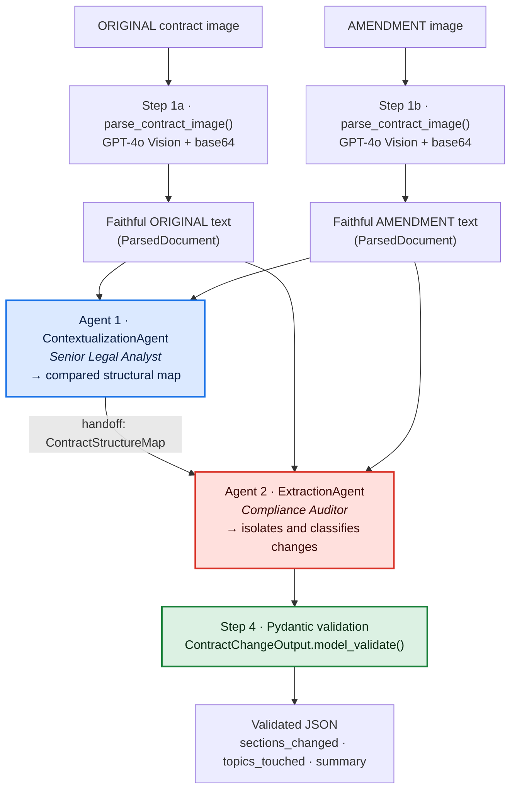

# LegalMove · Autonomous Contract Comparison Agent

A **multi-agent** system that takes scanned images of an **original contract**
and its **amendment**, reads them with **GPT-4o (Vision)** and, through two
specialized collaborating agents, identifies and summarizes the legal changes,
returning a **JSON output strictly validated with Pydantic** plus a **full
hierarchical trace in Langfuse**.

---

## 1. Business problem

At **LegalMove**, the Compliance team spends **40+ hours/week** manually
comparing contracts against their amendments to detect what changed and assess
the legal impact. It is slow, prone to human error, and a bottleneck that
prevents the company from scaling.

This system automates that work: from two images to a **structured, auditable
report** that the company's downstream systems can process without human
intervention.

---

## 2. Architecture



**Data flow (explicit handoff):**

1. **Vision** → each image is validated, encoded in base64 and sent to GPT-4o
   with a faithful-transcription prompt. Output: `ParsedDocument` (text +
   tokens + latency).
2. **Agent 1 (Contextualization)** → receives both texts and produces a
   `ContractStructureMap`: which sections exist in each document, how they map
   to each other, and what each block governs. It does **not** extract changes.
3. **Agent 2 (Extraction)** → receives **Agent 1's map** plus both texts and
   isolates every change, classifying it as ADDITION / DELETION / MODIFICATION.
   Output: `ContractChangeOutput`.
4. **Pydantic validation** → an explicit `model_validate()` over the output,
   on top of the *structured outputs* that already constrain the model at the
   source.

### Langfuse trace hierarchy

```
contract-analysis                    ← root span (= trace)
├── parse_original_contract          ← span  ─┐ GPT-4o Vision generation
│   └── (generation: gpt-4o)                  │ tokens + latency (auto)
├── parse_amendment_contract         ← span  ─┘
├── contextualization_agent          ← span  ─┐ ChatOpenAI generation
│   └── (generation: gpt-4o)                  │ via CallbackHandler (auto)
├── extraction_agent                 ← span  ─┘
│   └── (generation: gpt-4o)
└── pydantic_validation              ← span  (input/output/schema)
```

Each `span` records `input`, `output` and `metadata` (characters, tokens,
latency, model, number of sections). LLM calls are nested automatically as
*generations* with **token usage and latency** because:

* parsing uses the **Langfuse drop-in for OpenAI**
  (`from langfuse.openai import OpenAI`), and
* the agents use Langfuse's **`CallbackHandler` for LangChain**,

both propagated through the OpenTelemetry context of the active observation.

Additionally, following the **official Langfuse skill** (`instrumentation.md`),
the trace carries trace-level context via `propagate_attributes`:
`session_id` (groups all runs for the same contract pair → **Sessions view**),
`user_id` (cost/quality attribution → **Users view**), `version` (release) and
`tags`. The `environment` is set via `LANGFUSE_TRACING_ENVIRONMENT`. A `mask`
function redacts credentials and emails (PII) **before** anything is sent over
the wire; clause text is preserved on purpose because that is precisely what
Compliance needs to audit. The trace's `input/output` is derived from the root
observation (in v4 `set_trace_io` is deprecated).

---

## 3. Repository structure

```
.
├── src/
│   ├── main.py                      # Entry point + orchestration + Langfuse trace
│   ├── image_parser.py              # Validation, base64 and GPT-4o Vision call
│   ├── models.py                    # Pydantic models (data contract)
│   └── agents/
│       ├── base.py                  # Shared AgentError
│       ├── contextualization_agent.py   # Agent 1 (Senior Analyst)
│       └── extraction_agent.py          # Agent 2 (Compliance Auditor)
├── data/test_contracts/             # 2 contract pairs + README + generator
├── requirements.txt                 # Dependencies with pinned versions
├── .env.example                     # Environment variable template
└── README.md
```

---

## 4. Setup

Requirements: **Python 3.11+** (tested on 3.13), an OpenAI *API key* and a
project at [cloud.langfuse.com](https://cloud.langfuse.com).

```bash
# 1. Clone and enter the repo
git clone <repo-url> && cd <repo>

# 2. Virtual environment
python -m venv .venv
# Windows:
.venv\Scripts\activate
# Linux/macOS:
source .venv/bin/activate

# 3. Dependencies
pip install -r requirements.txt

# 4. Credentials
cp .env.example .env        # Windows: copy .env.example .env
#   and fill in OPENAI_API_KEY, LANGFUSE_PUBLIC_KEY, LANGFUSE_SECRET_KEY
```

Environment variables (`.env`):

| Variable | Required | Description |
|----------|----------|-------------|
| `OPENAI_API_KEY` | ✅ | OpenAI key (Vision + agents) |
| `OPENAI_MODEL` | ❌ | Model (default `gpt-4o`) |
| `LANGFUSE_PUBLIC_KEY` | ✅ | `pk-lf-...` |
| `LANGFUSE_SECRET_KEY` | ✅ | `sk-lf-...` |
| `LANGFUSE_HOST` | ✅ | `https://cloud.langfuse.com` |
| `LANGFUSE_TRACING_ENVIRONMENT` | ❌ | Trace environment (default `development`) |
| `LANGFUSE_RELEASE` | ❌ | Release (default `legalmove@<version>`) |
| `LANGFUSE_SESSION_ID` / `LANGFUSE_USER_ID` | ❌ | Override the auto-derived session/user |

---

## 5. Usage

```bash
# SIMPLE case (1 amount clause + 1 date clause)
python -m src.main \
  data/test_contracts/01_service_agreement_original.png \
  data/test_contracts/02_service_agreement_amendment.png

# COMPLEX case (addition + modification + deletion)
python -m src.main \
  data/test_contracts/03_nda_original.png \
  data/test_contracts/04_nda_amendment.png \
  --output outputs/nda_report.json --verbose
```

Output (simple case example):

```json
{
  "sections_changed": ["Clause 3 - Fees", "Clause 2 - Term"],
  "topics_touched": ["Pricing", "Term & Termination"],
  "summary_of_the_change": "MODIFICATION (Clause 3 - Fees): monthly fee increased from USD 5,000 to USD 6,500, effective 1 January 2026. MODIFICATION (Clause 2 - Term): end date extended from 31 December 2025 to 30 June 2026. No additions or deletions."
}
```

Options: `--model <id>`, `--session-id <id>`, `--user-id <id>`,
`--output <path>` (saves the JSON), `--verbose` (DEBUG logging). Exit codes:
`0` ok · `2` invalid file · `3` missing config · `4` vision error · `5` agent
error · `6` Pydantic validation.

---

## 6. Web front-end (Streamlit) and deployment

In addition to the CLI, the repo ships [`streamlit_app.py`](streamlit_app.py),
a single-screen wizard that **reuses the same pipeline**:

```bash
streamlit run streamlit_app.py
```

User flow: upload 2 images (or pick a preloaded test pair), click **Analyze**,
view the validated JSON + the summary + download the report. The trace is
recorded in Langfuse with the same `session_id` auto-derived per pair.

### Free deployment on Streamlit Community Cloud

1. Push the repo to GitHub.
2. Go to [share.streamlit.io](https://share.streamlit.io) → *Sign in with
   GitHub* → authorize.
3. **New app** → select repo + branch `main` + main file `streamlit_app.py`
   → **Deploy**.
4. In the deployed app panel: **Settings → Secrets** → paste:

```toml
OPENAI_API_KEY = "sk-proj-..."
OPENAI_MODEL = "gpt-4o"
LANGFUSE_PUBLIC_KEY = "pk-lf-..."
LANGFUSE_SECRET_KEY = "sk-lf-..."
LANGFUSE_HOST = "https://us.cloud.langfuse.com"
LANGFUSE_TRACING_ENVIRONMENT = "production"
# Optional: if set, a password gate appears before the wizard
# (protects against anyone with the URL burning through your API key).
app_password = "your-password"
```

The app restarts itself and is served on a public URL like
`https://<something>.streamlit.app`.

---

## 7. Output contract (Pydantic)

`ContractChangeOutput` — exactly the 3 required fields, with `extra="forbid"`
(if the model hallucinates an extra key, validation fails instead of polluting
production):

| Field | Type | Meaning |
|-------|------|---------|
| `sections_changed` | `List[str]` | Modified clauses/sections |
| `topics_touched` | `List[str]` | Legal/commercial categories affected |
| `summary_of_the_change` | `str` | Audit-grade narrative (change type + before/after values) |

Validators: normalization (`strip`), list de-duplication, and rejection of
empty/too-short summaries.

---

## 8. Technical decisions

**Why two agents instead of one?** Separation of concerns. A single
"read and extract changes" prompt mixes two cognitive tasks (understanding
structure and diffing) and increases hallucinations and omissions. **Agent 1**
builds a reliable structural map; **Agent 2** then spends 100% of its
attention diffing on top of that map. Concrete benefits: less hallucination,
shorter and more specialized *prompts*, and **auditable traces** — in Langfuse
you can see exactly what each agent understood, which is critical in a
legal/compliance setting.

**Why GPT-4o for parsing instead of traditional OCR?** Classic OCR (Tesseract)
returns noisy plain text and **loses the hierarchy** (clause numbers, nesting,
tables). GPT-4o is multimodal: it understands the document *layout* and
reconstructs the structure (`4.`, `4.1`, `(a)`), tolerates imperfect scans
and lets you instruct fidelity via prompt ("do not summarize, do not
interpret, copy verbatim, mark `[ILLEGIBLE]`"). That hierarchy is what later
lets the agents identify "Clause 3" reliably.

**System prompt design.** Each agent has an **explicit senior role**:
*Senior Legal Analyst* (structural cartographer, **forbidden** from listing
changes) vs. *Compliance Auditor* (only diffs, classifies as
ADDITION/DELETION/MODIFICATION, must cite before/after values, forbidden from
inferring changes without textual evidence). The *descriptions* on each
Pydantic field travel inside the *structured outputs* JSON schema, which
materially improves precision. Both prompts are also *instrument-aware*: they
spell out that the amendment is an **instrument that edits** the original (its
instruction headers and boilerplate like "No Other Changes" are NOT clauses),
and that a deletion is classified as DELETION (not MODIFICATION). This was
hardened after **end-to-end testing** revealed that a weaker model was taking
the amendment's scaffolding as new clauses.

**Error validation.** Two layers: (1) *structured outputs* with
`method="json_schema", strict=True` enforce the schema at the source;
(2) an explicit `ContractChangeOutput.model_validate()` in its own span
re-validates the result independently. API errors (timeout, rate limit,
invalid request, network) are caught in typed fashion in `image_parser` and
translated into `ContractParsingError` with an actionable message; images are
validated **before** spending an API call (existence, type, size ≤ 20 MB,
non-empty). OpenAI client configured with `timeout` and `max_retries`. Keys
are read only from environment variables (`python-dotenv`); nothing
hardcoded. If Langfuse cannot authenticate, the pipeline **degrades
gracefully** (it keeps working, only without tracing) so a live demo never
breaks.

**Why LangChain?** `with_structured_output()` + LCEL gives a typed,
deterministic *handoff* between agents (`temperature=0`), and Langfuse's
`CallbackHandler` instruments every call with no extra code.

**Observability (best practices from the official Langfuse skill).** The
instrumentation was audited against the official skill
`github.com/langfuse/skills` (`references/instrumentation.md`). Decisions:
(1) **SDK v4** — the skill requires using the latest version and keeping the
code aligned with the current documentation (key for the defense: if the
grader opens the Langfuse docs, the API matches). We use
`start_as_current_observation` + `propagate_attributes`; deprecated APIs
(`set_trace_io`) are avoided — verified by a smoke test that treats
`DeprecationWarning` as an error. (2) **Hierarchy + metrics**: the
integrations (OpenAI drop-in, LangChain handler) capture model/tokens/latency
automatically; each stage has descriptive names. (3) **`session_id`** groups
re-runs of the same pair in *Sessions*; **`user_id`** enables cost/quality
attribution in *Users*; `environment` + `release` separate dev/prod.
(4) **Masking**: a `mask` hook redacts keys (`sk-…`, `pk-lf-…`) and emails
before transmitting; clause text is preserved because it is the very data
Compliance must audit (an explicit decision, not an oversight). (5) **`flush()`
in `finally`** so traces are not lost when the CLI exits; imports ordered
after `load_dotenv()`. Guiding principle of the skill: *documentation-first*
— the v4 API was taken from the current docs, not from memory.

---

## 9. Limitations and future improvements

* Multi-page contracts: today 1 image per document; natural extension is to
  concatenate transcriptions from several pages.
* `summary_of_the_change` is audit-grade free text; a v2 could return a
  structured list of typed changes (an internal `ChangeType` enum is already
  in place for this).
* Automatic evaluation (golden set) of extraction accuracy.
